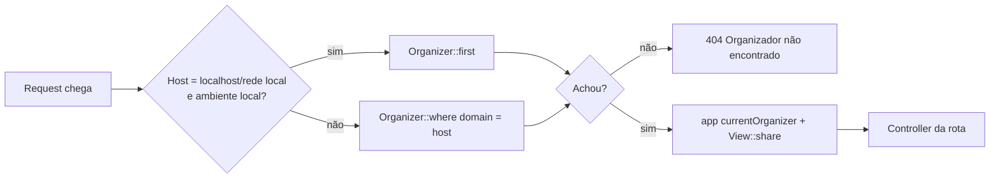
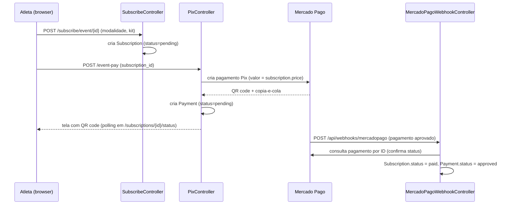

# Arquitetura

## Stack

- **Backend:** Laravel 12, PHP 8.3, arquitetura MVC clássica do Laravel (sem API separada — Blade server-rendered).
- **Frontend:** Blade + Tailwind CSS 4 (via `@tailwindcss/vite`) + Vite. Na prática hoje a maior parte do estilo está em CSS solto por página (`src/public/css/*.css`) e JS vanilla (`src/public/js/*.js`) — Tailwind está instalado mas pouco aproveitado. Isso vai ser substituído pelo template em `TEMPLATES/Front-End/` (ver ADR 0003 e `backlog.md`).
- **Banco:** PostgreSQL 16, em container (ver ADR 0001). Migrations em `src/database/migrations`.
- **Pagamentos:** Mercado Pago (Pix), via SDK oficial (`mercadopago/dx-php`), encapsulado em `App\Services\MercadoPagoService`.
- **Infraestrutura:** Docker Compose com 3 serviços — `app` (PHP-FPM 8.3), `nginx` (proxy + TLS via Let's Encrypt montado do host), `db` (Postgres). Um único `docker-compose.yml` serve dev e produção (sem overlay separado ainda).
- **Deploy:** GitHub Actions (`.github/workflows/deploy.yml`) → SSH num VPS → `git pull` + `docker-compose up -d --build` + `migrate --force` + `optimize`.

## Mapa de pastas

```
docker-compose.yml, docker/          → infraestrutura (app, nginx, db)
src/                                  → aplicação Laravel (raiz do Composer/Artisan)
  app/Http/Controllers/
    Auth/                             → login, registro, verificação de e-mail
    Events/                           → listagem/detalhe de evento, modalidades, kits
    Subscriptions/                    → inscrição, Pix, webhook do Mercado Pago
  app/Http/Middleware/
    IdentifyOrganizerByDomain.php    → resolve o tenant a partir do domínio
  app/Models/                        → Organizer, Event, EventModality, EventKit, Subscription, Payment, User
  app/Services/MercadoPagoService.php → integração Pix
  database/migrations, seeders, factories
  resources/views/                   → Blade
  routes/web.php, api.php
docs/                                 → esta documentação viva
TEMPLATES/                            → templates externos de referência (Front-End/ = site público, já recebido)
```

## Multi-tenancy: isolamento por domínio

O middleware `App\Http\Middleware\IdentifyOrganizerByDomain` roda em toda request web, pega o host (`$request->getHost()`), busca o `Organizer` com esse `domain` e compartilha o organizador atual via `app('currentOrganizer')` + variáveis de view (`organizerName`, `organizerId`, `organizerEmail`). Em `local` com host `localhost`/`127.0.0.1`/rede local, pega o **primeiro** organizador do banco automaticamente (facilita dev sem precisar configurar `/etc/hosts`).



**Isolamento atual é parcial** — `EventsController` filtra eventos por `organizer_id` corretamente, mas `SubscribeController` busca o `Event` só pelo ID (sem checar se pertence ao organizador do domínio atual), e `User.organizer_id` nunca é preenchido no cadastro. Detalhes e prioridade em `backlog.md` e `specs/multi-tenancy-e-autenticacao.md`.

## Painel administrativo: escopo pelo usuário, não pelo domínio

O painel (`/admin`) é a exceção deliberada ao modelo acima. Enquanto o site público descobre o organizador pelo **domínio da requisição**, dentro do painel o organizador é o do **usuário logado** (`users.organizer_id`) — o painel precisa funcionar tanto em `admin.correvirtual.com.br` quanto em `/admin` do domínio do organizador, e em ambos o organizador correto é o do usuário.

Duas travas na entrada, ambas obrigatórias: `auth` (logado) e `EnsureOrganizerAdmin` (papel `organizer_admin` **e** `organizer_id` preenchido — o papel sozinho não basta, porque sem organizador as consultas ficariam sem filtro).

Por causa dessa exceção, `IdentifyOrganizerByDomain` deixa passar sem 404 as rotas `admin`, `admin/*`, `login` e `logout` quando o domínio não pertence a nenhum organizador. Fora dessas rotas o comportamento continua o mesmo: domínio desconhecido → 404.

Todos os controllers do painel herdam de `App\Http\Controllers\Admin\AdminController`, que expõe `organizerId()`. A regra que vale em todos: buscar registro específico **já filtrando** pelo organizador e devolver 404 se não achar — nunca buscar por ID solto e conferir depois. Para modalidade e kit, que não têm `organizer_id` próprio, o filtro passa pelo evento.

Detalhes em `docs/specs/painel-admin.md`; a decisão de construir aqui em vez de no Cubo está no ADR 0006.

## Fluxo de inscrição + pagamento



Ponto crítico: o valor cobrado (`subscription.price`) está incorreto hoje — ver `backlog.md` (BUG-001) e `specs/pagamentos-pix.md`.

## Preço: modalidade × kit × lote (ADR 0007, 2026-09-23)

O valor de uma inscrição deixa de ser o preço do kit e passa a ser uma célula
de `event_prices`, indexada por `(modality_id, kit_id, lot_id)`. `event_lots`
são janelas de vigência (o sistema resolve o lote vigente na hora, sem
ativação manual); `event_kit_modality` diz em quais modalidades cada kit vale;
`kit_options` guarda a variação do kit (só `shirt_size` por ora);
`age_categories` é desconto por idade, calculado pelo critério do evento
(`events.age_criteria`). Na inscrição, `lot_id`, `age_category_id` e
`age_discount_amount` completam o retrato financeiro — `discount_amount`
continua sendo só o cupom. Descontos em cascata: idade sobre o preço base,
cupom sobre o que sobrou. `event_kits.price` fica na tabela como histórico.

Entrega em fatias: a **fatia 1** (estrutura + painel) não muda o checkout; a
**fatia 2** faz o fluxo do atleta ler a grade. Spec:
`docs/specs/precos-lotes-e-categorias.md`.

## Ambientes

| Ambiente | Como sobe | Banco |
|---|---|---|
| Local | `docker compose up -d --build` (este repo) | Postgres em container, sem dados reais |
| Produção | GitHub Actions → SSH → `docker-compose up -d --build` no VPS | Postgres em container no mesmo VPS (ver ADR 0001) |

Detalhes operacionais (variáveis de ambiente, comandos, troubleshooting) estão em `runbook.md`, não aqui — este documento é sobre *como o sistema é construído*, não *como operá-lo no dia a dia*.
