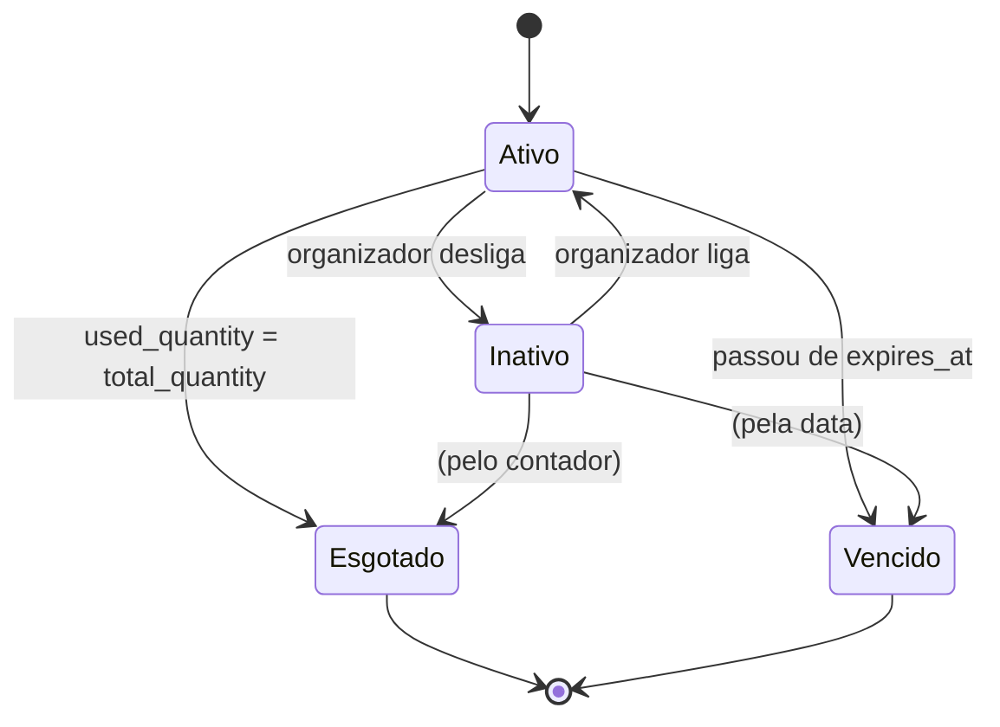

# Cupons de desconto

Status: Implementado — cadastro e gestão (2026-09-19) e aplicação na inscrição do atleta (2026-09-20).

## Problema

O organizador não tem nenhuma forma de dar desconto. Hoje, para fazer uma
promoção — parceria com assessoria, cortesia de patrocinador, campanha de
lançamento, "traga um amigo" — sobram duas saídas ruins: baixar o preço do kit,
que muda o valor **para todo mundo**, ou acertar por fora da plataforma e receber
o atleta já inscrito sem pagamento registrado. As duas quebram o relatório de
caixa e nenhuma é reversível.

Cupom é a ferramenta padrão de qualquer plataforma de inscrição esportiva
justamente porque resolve isso: desconto controlado, com validade, com teto de
uso, rastreável, e que não toca no preço de tabela.

## Requisitos

- [x] O organizador cria, edita, ativa/inativa e apaga cupons dos eventos dele.
- [x] Todo cupom pertence a **um** evento. Cupom de um evento nunca vale em outro.
- [x] O código tem 6 ou 7 caracteres, só A–Z e 0–9, sempre gravado em maiúsculo,
      e não se repete dentro do mesmo evento.
- [x] O desconto é percentual (1 a 100) ou valor fixo em reais (maior que zero).
- [x] O cupom tem uma quantidade total de usos e uma data de expiração.
- [x] A quantidade utilizada nunca é editável na mão.
- [x] Um cupom que já teve uso não pode ser apagado, e nem o código nem o evento
      dele podem ser trocados.
- [x] Um cupom esgotado ou vencido lê como inativo e não pode ser reativado.
- [x] Enquanto não estiver encerrado, o organizador liga e desliga o cupom à
      vontade, mesmo com usos registrados.
- [x] O incremento do contador de uso não estoura o limite sob concorrência.
- [x] Nenhum organizador enxerga, edita ou apaga cupom de outro, nem informando
      o id na URL.
- [x] O atleta informa um cupom ao se inscrever, vê o valor com desconto antes
      de enviar, e o Pix sai com o valor já descontado — sempre com duas casas.
- [x] Cupom que zera o valor confirma a inscrição na hora, sem gerar pagamento.
- [x] Um cupom por inscrição. O uso é consumido de forma atômica na criação da
      inscrição, e não volta se ela for cancelada.
- [x] A inscrição guarda o próprio retrato financeiro (preço de tabela,
      desconto, valor cobrado, cupom), para o financeiro futuro ler sem
      reconstruir nada.

## Fora de escopo

De propósito:

- **Cupom do organizador valendo em vários eventos.** Um cupom para a temporada
  inteira é pedido comum, mas mudaria a chave da tabela e a regra de unicidade.
  Enquanto houver um organizador com poucos eventos, recadastrar é mais barato
  que a estrutura.
- **Cupom por modalidade ou por kit** (desconto só no 10 km, só no kit camiseta).
- **Cupom de uso único por atleta.** O limite é global do cupom, não por pessoa.
  Como a inscrição é única por `(event_id, user_id)`, o mesmo atleta só repete o
  cupom se cancelar e se inscrever de novo — e aí gasta dois usos (ver
  "Cancelamento" abaixo).
- **Geração automática de códigos em lote.**
- **Expirar inscrição pendente.** Uma inscrição com cupom que nunca é paga nem
  cancelada segura o uso para sempre. É o mesmo buraco de sempre da cobrança
  Pix vencida (`docs/specs/pagamentos-pix.md`, "Fora de escopo"), agora com uma
  consequência a mais.

## Design

### Tabela `coupons`

| Coluna | Tipo | Observação |
|---|---|---|
| `id` | id | |
| `event_id` | FK → events | `cascadeOnDelete`. Apagar o evento leva os cupons dele. |
| `code` | string(7) | 6–7 caracteres, A–Z e 0–9, sempre maiúsculo |
| `description` | text nullable | anotação do organizador; não aparece para o atleta |
| `discount_type` | string(10) | `percent` ou `amount` |
| `discount_value` | decimal(10,2) | 1–100 se percentual; > 0 se valor |
| `total_quantity` | unsignedInteger | quantos usos o cupom permite |
| `used_quantity` | unsignedInteger, default 0 | só o sistema escreve |
| `expires_at` | date | vale **até o fim** desse dia |
| `active` | boolean, default `true` | liga/desliga manual |
| timestamps | | |

Índice: `unique(event_id, code)` — que também serve de índice para `event_id`,
já que a coluna é o primeiro campo da chave.

**Sem `organizer_id`.** O vínculo com o organizador passa pelo evento, como em
`event_kits` e `event_modalities`. É a mesma escolha já registrada no
`DashboardController` para `subscriptions`: quem não tem organizador próprio
chega nele por `whereHas('event', …)`.

**`discount_type` é `string` e não `enum`.** Dev roda Postgres e produção roda
MySQL (ADR 0005), e `enum` vira coisa diferente em cada um — no Postgres, o
Laravel monta um `varchar` com `check`; no MySQL, um tipo nativo. Não vale a
divergência por uma coluna de dois valores que o model e a validação já garantem.

### Unicidade por evento, não global

O código é único **dentro do evento**, não no sistema inteiro. Unique global
acoplaria organizadores diferentes: o organizador A passaria a bloquear
"CORRE10" para o B, e a mensagem de erro contaria que o código existe em algum
lugar que o B não pode ver — o mesmo tipo de vazamento entre inquilinos que o
BUG-005 representa. Como a busca do cupom sempre parte do evento em que ele está
sendo usado, não existe ambiguidade a resolver.

### Estados do cupom

Não há coluna de status: o estado é deduzido, como a situação do evento já é
deduzida das datas (`Event::situacao()`).



**Encerrado** = esgotado **ou** vencido. É um estado sem volta: o toggle fica
desabilitado na tela e o backend recusa a troca nos dois sentidos — um cupom
encerrado já lê como inativo, então "desligar" não significaria nada.

Um cupom **vale para uso** quando `active = true`, não está vencido e ainda tem
saldo. Essa é a condição que a fatia da inscrição vai consultar.

### Consumo atômico

`Coupon::registrarUso()` não lê e depois grava — faz um `UPDATE` condicional e
olha quantas linhas mudaram:

```php
static::whereKey($this->getKey())
    ->where('active', true)
    ->whereColumn('used_quantity', '<', 'total_quantity')
    ->where('expires_at', '>=', now()->toDateString())
    ->increment('used_quantity');
```

Duas requisições disputando a última vaga: quem chega depois recebe 0 linhas
afetadas e sai com `false`. Sem transação, sem lock explícito e sem estourar o
limite — a condição vive no `WHERE`, que o banco avalia e aplica na mesma
operação. É a diferença entre "sobrou 1, pode usar" (que pode estar velho quando
o `UPDATE` sai) e "decremente **se** sobrar".

### Travas depois do primeiro uso

Uma vez que o cupom foi usado, ele deixou de ser só um cadastro e virou parte do
histórico de quem pagou menos:

- **Apagar** deixa de ser possível. A saída é desativar.
- **Código e evento** ficam congelados. Trocar o código de um cupom já usado
  reescreveria o passado; trocar o evento moveria um desconto concedido para uma
  prova onde ele nunca valeu.
- Desconto, quantidade, validade, descrição e o liga/desliga continuam editáveis
  — são o futuro do cupom, não o passado.

As três travas vivem no controller, não só na tela. A tela desabilita o botão e
trava o campo porque é o comportamento honesto; o servidor recusa porque
esconder no front não é proteger.

### Rotas

Dentro do grupo `/admin` já existente (`auth` + `organizer.admin`):

```
GET     /admin/cupons                lista, filtra e busca
POST    /admin/cupons                cria
PUT     /admin/cupons/{id}           atualiza
DELETE  /admin/cupons/{id}           apaga (só sem uso)
PATCH   /admin/cupons/{id}/status    liga/desliga
```

Sem `create` e `edit`: o formulário é um modal da própria listagem, o único do
painel — os outros cinco cadastros usam página cheia. A escolha foi do dono do
projeto: cupom é registro curto e de vida curta, e sair da lista para criar um e
voltar para criar o próximo é atrito à toa.

O escopo segue a regra geral do painel: busca **já filtrando** pelo organizador
do usuário logado (via evento) e 404 se não achar — nunca busca por id solto e
confere depois.

### Tela

Uma tela só, `/admin/cupons`, com filtro por evento e busca por código. A tabela
mostra código, evento, desconto formatado (`10%` ou `R$ 25,00`), expiração,
quantidade gerada, quantidade utilizada, o toggle de situação e as ações.

O `<select>` de evento do formulário lista apenas eventos do organizador que
ainda não aconteceram — prova realizada não recebe cupom novo. Na edição, o
evento atual do cupom entra na lista mesmo se a prova já passou, senão não daria
para corrigir a descrição de um cupom antigo.

### No checkout (2026-09-20)

#### O retrato financeiro em `subscriptions`

| Coluna | Tipo | Observação |
|---|---|---|
| `list_price` | decimal(8,2) nullable | preço do kit na hora da inscrição; o model copia de `price` quando não vem |
| `discount_amount` | decimal(8,2), default 0 | o que o cupom abateu |
| `price` | decimal(8,2) | **o que foi cobrado** (já existia; nada que lê muda) |
| `coupon_id` | FK → coupons, nullable, `nullOnDelete` | qual cupom |

Gravado na criação e nunca alterado. É isto que um relatório financeiro por
evento vai ler — sem consultar o kit (que muda de preço) nem o cupom (que é
editável). `nullOnDelete` e não `restrictOnDelete`: o valor está nas colunas,
não no vínculo, e um `RESTRICT` criaria um modo de falha novo no cascade
`event → coupons`.

Linhas anteriores à migration receberam `list_price = price` — nenhuma teve
desconto.

#### A conta (`App\Services\PrecoDaInscricao`)

Toda a conta é em **centavos inteiros**: `round(preço × 100)`, percentual
`round(centavos × pct / 100)` (meio para cima), valor fixo como está, teto no
próprio valor, líquido por subtração de inteiros. Só no fim vira reais. Assim a
tela, a coluna `price` e o valor enviado ao Mercado Pago nunca discordam num
centavo. `Coupon::descontoSobre()` delega para a mesma conta — uma regra só.

| Kit | Cupom | Desconto | Cobrado |
|---|---|---|---|
| 89,90 | 10% | 8,99 | 80,91 |
| 89,90 | 12,5% | 11,24 | 78,66 |
| 59,90 | R$ 25 | 25,00 | 34,90 |
| 30,00 | R$ 50 | 30,00 | 0,00 (gratuita) |
| 89,90 | 100% | 89,90 | 0,00 (gratuita) |

#### O fluxo (`SubscribeController::subscribe`)

1. Evento aberto (regra que já existia).
2. Valida modalidade, kit e o campo `cupom` (opcional).
3. **Já inscrito?** Redireciona como sempre — antes de encostar no cupom, para
   não gastar uso de quem não vai criar inscrição.
4. `CupomNoCheckout::localizar()` acha o cupom **pelo evento** e valida
   (existe, ativo, não vencido, com saldo). Recusa vira erro no campo `cupom`,
   com o motivo.
5. `PrecoDaInscricao::para(kit, cupom)`.
6. Numa transação: `Coupon::registrarUso()` (o `UPDATE` condicional — se a
   última vaga foi para outro atleta entre a prévia e o envio, é aqui que
   aparece e a transação desfaz) e a criação da inscrição com o retrato.
7. Valor zero → `ConfirmacaoDeInscricao::confirmar()` e a inscrição já nasce
   `paid`, com `confirmed_at` e o e-mail de confirmação — sem `Payment`, sem
   Pix. Senão, segue para "Minhas inscrições" e o Pix como sempre.

**Um cupom por inscrição** é estrutural: uma coluna, um campo, e a unique
`(event_id, user_id)` impede segunda inscrição no mesmo evento.

#### Prévia (`POST /subscribe/event/{id}/cupom`)

O formulário mostra o preço no kit e, ao aplicar o código, chama este endpoint
(logado, `throttle:20,1`) que devolve bruto, desconto e total em JSON — **sem
criar nada e sem consumir uso**. É conveniência: o envio refaz todas as
checagens. O throttle é a defesa barata contra tentar códigos no chute.

#### Cancelamento

Cancelar uma inscrição pendente (que apaga a linha) **não devolve** o uso do
cupom. Decisão do dono (2026-09-20): uso consumido é uso gasto, mesmo sem
pagamento. Consequência assumida: quem se inscreve, cancela e se inscreve de
novo com o mesmo cupom gasta dois usos; e o organizador pode ver "utilizadas
10" com menos de 10 inscrições pagas.

#### Uma confirmação só (`App\Services\ConfirmacaoDeInscricao`)

O update condicional (`status != 'paid'` → `paid` + `confirmed_at`) e o e-mail
só quando afetou uma linha saíram do webhook para um serviço, que a inscrição
gratuita também chama. Efeito colateral bem-vindo: o webhook passou a gravar
`confirmed_at`, que ficava vazio.

#### O que foi fechado de passagem

`PixController::generatePix` buscava a inscrição por id solto — qualquer
usuário logado gerava Pix para qualquer inscrição. Passou a filtrar por
`user_id` do logado (404 se não for dele) e a recusar inscrição já confirmada ou
de valor zero. A rota `/event-pay` ganhou `auth` explícito.

## Plano de testes

**Checkout** — `tests/Feature/InscricaoComCupomTest.php`: retrato financeiro
gravado e uso consumido; código normalizado; sem cupom nada muda; cupom de outro
evento, inativo, vencido, esgotado ou inexistente recusado sem criar nada e sem
mexer no contador; já inscrito não gasta uso; último uso disputado só um leva;
cancelar não devolve; 100% confirma na hora sem `Payment` e com e-mail; valor em
reais maior que o kit zera sem negativo; o e-mail renderiza com cupom e valor; o
Pix é gerado com o valor já descontado; formulário mostra preço e campo; "Minhas
inscrições" mostra o valor, o desconto e "Gratuita" sem botão de pagar; a prévia
devolve os valores sem consumir, recusa com motivo, exige kit do evento, recusa
evento fechado e exige login.

`tests/Unit/PrecoDaInscricaoTest.php` — a tabela de valores acima, o ruído de
float que não vaza, `paraInscricao()`, formatação, e `Coupon::descontoSobre()`
concordando com a conta.

`tests/Unit/ConfirmacaoDeInscricaoTest.php` — confirma uma vez com
`confirmed_at`; segunda chamada não reconfirma nem reenvia e-mail.

`PixControllerTest` — inscrição de outro usuário → 404; já paga e valor zero →
recusa; sem login → login. `MercadoPagoWebhookControllerTest` — os cinco casos
de antes, mais `confirmed_at` preenchido.

**Cadastro** — `tests/Feature/Admin/CouponCrudTest.php` — no molde de `SponsorCrudTest`, com
dois organizadores e um admin de apenas um deles:

- Criação normalizando a entrada (`"  corre10 "` vira `CORRE10`).
- Recusa: código de 5 caracteres, código com hífen, código repetido **no mesmo
  evento**. Aceita o mesmo código em **outro** evento.
- Recusa: percentual 0 e 101, valor 0, quantidade 0, data no passado.
- Recusa criar cupom em evento de outro organizador.
- Isolamento: a listagem não mostra cupom alheio; `update`, `destroy` e `status`
  de cupom alheio devolvem 404 e o registro do outro fica intacto.
- Apagar cupom sem uso funciona; com uso, é recusado e o registro continua lá.
- Cupom usado: `code` e `event_id` enviados na marra são recusados; os demais
  campos gravam normalmente.
- Toggle liga e desliga; esgotado e vencido são recusados.
- Filtro por evento e busca por código.

`tests/Unit/CouponTest.php`:

- `registrarUso()` incrementa, e devolve `false` quando a última vaga acabou —
  duas chamadas seguidas na última vaga não passam do total.
- `encerrado()` por esgotamento e por data; vencendo **hoje** ainda vale.
- `descontoSobre()` nos dois tipos, e o teto no valor da inscrição (cupom de
  R$ 50 num kit de R$ 30 abate R$ 30, não gera cobrança negativa).
- `descontoFormatado()`.

## Critérios de aceite

- O organizador cria, edita, liga/desliga e apaga cupons pelo navegador, com o
  visual do painel.
- Cupom usado não é apagado nem tem código/evento trocados, mesmo com a
  requisição montada na mão.
- Cupom esgotado ou vencido não reativa.
- Nenhum organizador alcança cupom de outro.
- O atleta vê o valor com desconto antes de enviar e o Pix cobra exatamente
  esse valor, com duas casas.
- Cupom que zera o valor confirma sem pagamento; nenhum `Payment` é criado.
- O contador nunca passa do total, mesmo com dois atletas disputando a última
  vaga.
- A suíte passa inteira.
- `CHANGELOG.md` e `docs/backlog.md` atualizados.
